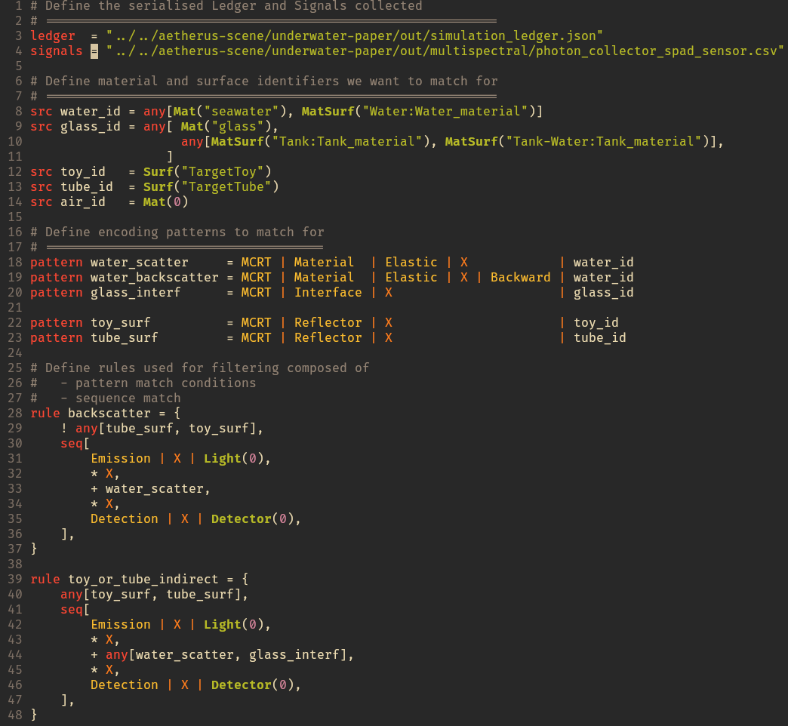

# Eldritch-Trace filtering DSL

<!-- TODO: Add docs badge -->
<!-- TODO: Add crates.io badge -->
[](https://github.com/aetherus-wg/eldritch-trace/actions)
[](#license)
[](https://aetherus-wg.github.io/eldritch-trace/)
[](https://github.com/aetherus-wg/eldritch-trace/tags)

This project defines the grammar of our DSL, implements the parser and
translation to the AST to be used by the filtering methods in `aetherus-events`.

> [!NOTE] 
> While we present the DSL focused here on MCRT simulation,
> it can filter and parse any encoding that can be fitted for `aetherus-events`

## Overview

The Eldritch-Trace DSL is used to specify the criteria we are looking for
signals of interest to meet, then walk the Ledger to find all terminal UIDs that
meet these conditions, which are then used to extract the signals from the total
stream produced by the simulation. 

Example of conditions used for filtering: 
- emission source
- interactions with specific objects, 
- sequence of events
- count repetitions of events matching a pattern
- etc.

The following `Eldritch-Trace` script can be use to filter events presented in
the Ledger serialised further down.



```json
{
  "grps": {},
  "src_map": {
    "Mat(1)":         [ { "Mat": "glass"                        }],
    "Mat(4)":         [ { "Mat": "translucent_pla"              }],
    "Surf(0)":        [ { "Surf": "TargetTube"                  }],
    "Surf(1)":        [ { "Surf": "TargetToy"                   }],
    "MatSurf(65535)": [ { "MatSurf": "Tank-Water:Tank_material" }],
    "MatSurf(65534)": [ { "MatSurf": "Tank:Tank_material"       }],
    "Mat(0)":         [ { "Mat": "air"                          }],
    "MatSurf(65533)": [ { "MatSurf": "Water:Water_material"     }],
    "Mat(2)":         [ { "Mat": "mist"                         }],
    "Mat(3)":         [ { "Mat": "seawater"                     }]
  },
  "start_events": [
    { "seq_id": 0, "event": "0x1010000" }
  ],
  "next_mat_id": 5,
  "next_surf_id": 2,
  "next_matsurf_id": 65532,
  "next_light_id": 0,
  "next": {
    "0": { "0x01010000": 1 },
    "1": { "0x0300FFFE": 17, "0x0301FFFE": 2 },
    "2": { "0x0300FFFF": 211, "0x03010003": 3, "0x03A0FFFE": 2663 },
    "3": {
      "0x0300FFFD": 21,
      "0x0300FFFF": 24,
      "0x0301FFFF": 4,
      "0x03440000": 14,
      "0x03440001": 99,
      "0x03A00003": 194,
    },
    "4": { "0x0300FFFE": 6 },
    // ... more entries ...
  },
  "prev": {
    "1": "0, 0x01010000",
    "2": "1, 0x0301FFFE",
    "3": "2, 0x03010003",
    "4": "3, 0x0301FFFF",
    "5": "4, 0x03010000",
    "6": "4, 0x0300FFFE",
    "7": "6, 0x0300FFFF",
    // ... more entries ...
  }
}
```

## Specification


## Predicates

Sequence, patterns and fields can have unary predicates.

| Operator | Description                                                |
|----------|------------------------------------------------------------|
| `!`        | Don't match                                                |
| `?`        | Optional, can appear once or none                          |
| `*`        | Match for any number of times                              |
| `+`        | Match for any number of times that find at least one match |
| `{n,m}`    | Match for at least n times and at most m times             |
| `{,m}`     | Match for at most m times                                  |
| `{n,}`     | Match for at least n times                                 |
| `{n}`      | Match exactly n times                                      |

### Field

The field can only have the "!" operator, to check bits mask non equality.
Otherwise, the normal bits match is used.

### Pattern

Patterns can have any of the unary predicates listed above

### Sequence

Sequences can only have an "{n}" predicate that will be unrolled and flatten the
sequence.

> [!NOTE]
> More advanced features to check for non match with "!" could be added later for
> more complex checks on the sequence, but otherwise keep it simple.

## List constructs

- `any`: Allow match to any of the members listed
  - `src`
  - `pattern`
  - `seq`: Not allowed for now, not sure if necessary
- `perm`: Allow match in any order
  - `pattern`
- `seq`: Allow match in the order specified
  - `pattern`
  - `seq`
  - `perm`
  - `any[pattern]`

## Resources

- [chumsky](https://docs.rs/chumsky/latest/chumsky/index.html)
- [pest](pest.rs)
- [Bachus-Naur Form](https://en.wikipedia.org/wiki/Backus%E2%80%93Naur_form)

## TODO

- [ ] Benchmarks with [bencher](https://bencher.dev) for [Statistical Continuous
  Benchmarking](https://bencher.dev/docs/how-to/track-benchmarks/#statistical-continuous-benchmarking)
  - [ ] Criterion benchmarking of a the translucent plate example
  - [ ] Inline tests benches using `libtest`
  - Maybe add [gungraun](https://github.com/gungraun/gungraun) later for more informative performance metrics
- [X] Vim syntax highlight
- [ ] Tree-sitter parser and syntax highlight
  - [tree-sitter docs](https://tree-sitter.github.io/tree-sitter/)
  - [contributing
  language](https://github.com/nvim-treesitter/nvim-treesitter/blob/main/CONTRIBUTING.md#Parsers)

## Filter DSL - Grammar visualisation

We are looking into how we could visualise the Parser tree, since it can be
quite daunting to look at the parser combinator code and figure out what is
happening.

This requires first to have the grammar specified in BNF/EBNF, then parse and
produce **railroad** diagram.

### Diagram generators

- [AMAZING online converter and viewer on bottlecaps](https://www.bottlecaps.de/ebnf-convert/)
- [pest_railroad: `pest` grammar to SVG](https://github.com/nu11ptr/pest_railroad)
- [bnf2railroad: (E)BNF grammar to SVG/HTML](https://github.com/willy610/bnf2railroad)
- [ebnsf: BNF to SVG using `railroad-JS`](https://crates.io/crates/ebnsf)
- [railroad-diagrams: JS/Python lib to gen
SVG/Unicode](https://github.com/tabatkins/railroad-diagrams/tree/gh-pages)
- [ebnf2ps: EBNF to EPS/FIG](https://github.com/FranklinChen/Ebnf2ps)
  - [PDF
  Documentation](https://raw.githubusercontent.com/FranklinChen/Ebnf2ps/master/doc/doc.pdf)
- [bottlecaps ebnf-convert](https://www.bottlecaps.de/ebnf-convert/)
