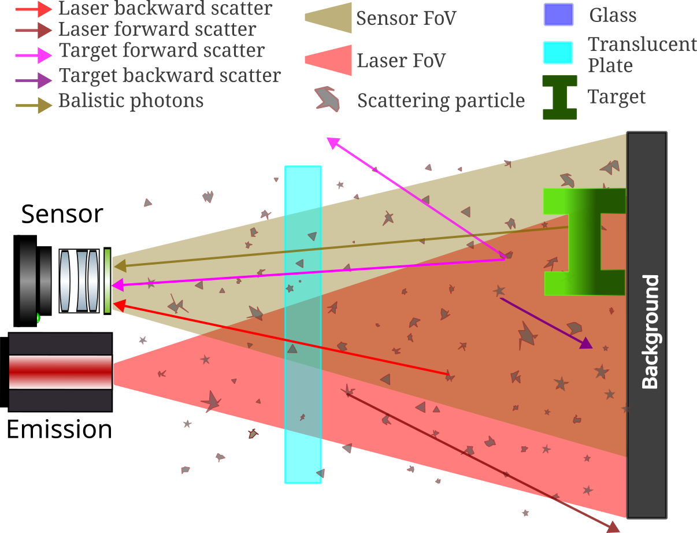

# User Guide

Here is an example script used to filter the events for the scene described in the
diagram below.



```eldritch-trace
# Define the serialised Ledger and Signals collected
# ============================================================
ledger  = "../../aetherus-scene/underwater-paper/out/simulation_ledger.json"
signals = "../../aetherus-scene/underwater-paper/out/multispectral/photon_collector_spad_sensor.csv"

# Define material and surface identifiers we want to match for
# ============================================================

src water_id = any[Mat("seawater"), MatSurf("Water:Water_material")]
src glass_id = any[Mat("glass"), any[MatSurf("Tank:Tank_material"), MatSurf("Tank-Water:Tank_material")]]
src toy_id   = Surf("TargetToy")
src tube_id  = Surf("TargetTube")
src air_id   = Mat(0)

# Define encoding patterns to match for
# =====================================

pattern water_scatter     = MCRT | Material  | Elastic | X            | water_id
pattern water_backscatter = MCRT | Material  | Elastic | X | Backward | water_id
pattern glass_interf      = MCRT | Interface | X                      | glass_id

pattern toy_surf          = MCRT | Reflector | X                      | toy_id
pattern tube_surf         = MCRT | Reflector | X                      | tube_id


# Define sequences of events in the photon history to search for
# ==============================================================

sequence toy_detect = seq[
    Emission | X | Light(0),
    * X,
    toy_surf,
    * X,
    Detection | X | Detector(0),
]

sequence tube_detect = seq[
    Emission | X | Light(0),
    * X,
    tube_surf,
    * X,
    Detection | X | Detector(0),
]

sequence seq_water_backscatter = seq[
    Emission | X | Light(0),
    * X,
    water_scatter,
    * X,
    Detection | X | Detector(0),
]

# Note how rule tries to validate all conditions enumerated
rule backscatter = {
    ! any[tube_surf, toy_surf],
    seq[
        Emission | X | Light(0),
        * X,
        + water_scatter,
        * X,
        Detection | X | Detector(0),
    ],
}

rule toy_or_tube_detect = {
    any[toy_surf, tube_surf],
    seq[
        Emission | X | Light(0),
        * X,
        + water_scatter,
        * X,
        Detection | X | Detector(0),
    ],
}
```


The ledger serialised to a JSON file is as follows:

```json
{
  "grps": {},
  "src_map": {
    "Mat(0)": [ { "Mat": "air" } ],
    "Mat(2)": [ { "Mat": "translucent_pla" } ],
    "Mat(1)": [ { "Mat": "mist" } ],
    "Surf(0)": [ { "Surf": "Background" } ],
    "Surf(1)": [ { "Surf": "Target" } ],
    "MatSurf(65535)": [ { "MatSurf": "TranslucentPlate:TranslucentPLA" } ]
  },
  "start_events": [ { "seq_id": 0, "event": "0x1010000" } ],
  "next_mat_id": 3,
  "next_surf_id": 2,
  "next_matsurf_id": 65534,
  "next_light_id": 0,
  "next": {
    "0": { "0x01010000": 1 },
    "1": { "0x0300FFFF": 9, "0x0301FFFF": 2, "0x03A00001": 70268 },
    "2": { "0x03A0FFFF": 3 },
    "3": { "0x0300FFFF": 391, "0x03010001": 4, "0x03A0FFFF": 5 },
    "4": { "0x05000000": 50 },
    // ...more entries...
  },
  "prev": {
    "1": "0, 0x01010000",
    "2": "1, 0x0301FFFF",
    "3": "2, 0x03A0FFFF",
    "4": "3, 0x03010001",
    "5": "3, 0x03A0FFFF",
    // ...more entries...
  },
  "next_seq_id": 3747279,
}
```
